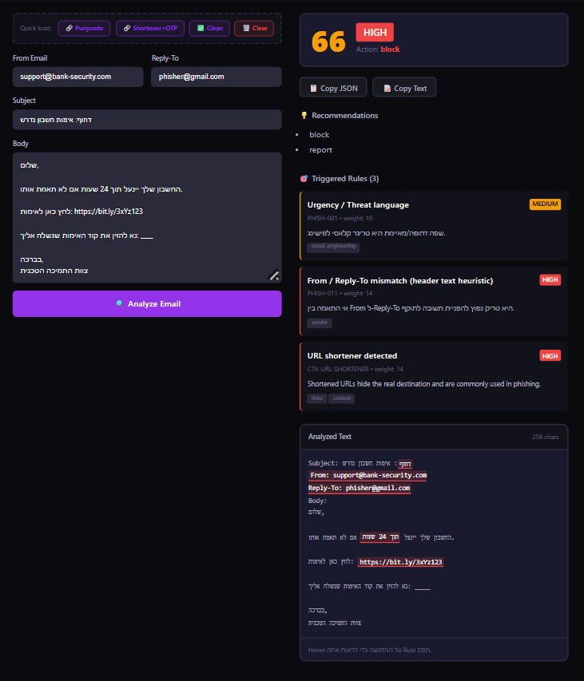
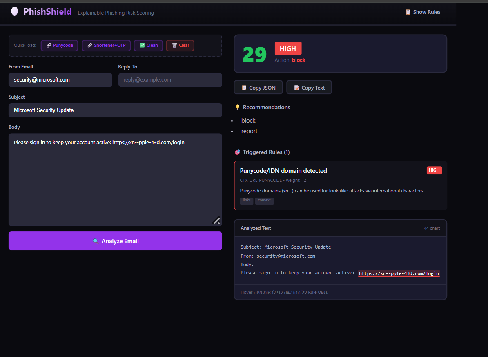
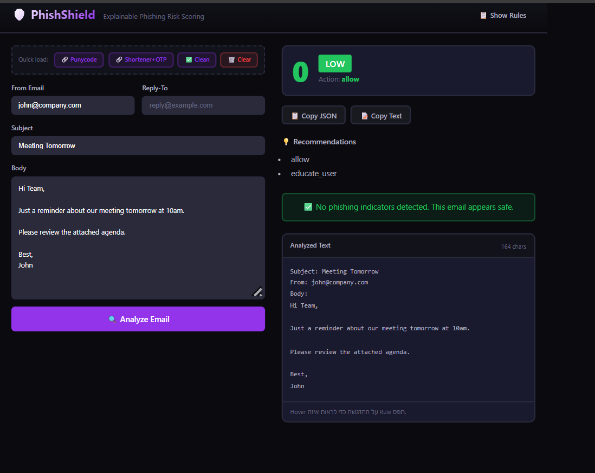

# 🛡️ PhishShield

**Explainable phishing email analyzer with real-time risk scoring.**

PhishShield is a defensive security tool that analyzes emails for phishing indicators. Unlike black-box solutions, it provides clear explanations for every detection — showing exactly which rules triggered and why.

Built for SOC analysts, security awareness training, and anyone who needs to understand *why* an email is suspicious.



---

## Features

- **Rule-based detection** — YAML-configurable rules for keywords, regex, and context patterns
- **Context-aware analysis** — Extracts URLs, domains, emails to detect URL shorteners, punycode attacks, deep subdomain chains
- **Explainable results** — Every hit shows rule ID, weight, evidence, and human-readable explanation
- **Risk scoring** — 0-100 score with severity levels (low/medium/high) and recommended actions
- **Text highlighting** — Visual highlights showing exactly where suspicious content was found
- **SOC workflow** — Copy JSON/text buttons for incident documentation
- **Hebrew + English** — Full support for RTL text and Hebrew phishing patterns

---

## Quick Start

### Prerequisites

**Option A — Docker (Recommended):**
- Docker Desktop

**Option B — Local Development:**
- Python 3.10+
- Node.js 18+

---

### Option A: Docker (One Command)

```bash
git clone https://github.com/yourorg/phishshield.git
cd phishshield

make up
```

That's it. Wait for build to complete, then open:

| Service | URL |
|---------|-----|
| **UI** | http://localhost:5173 |
| **API** | http://localhost:8000 |
| **API Docs** | http://localhost:8000/docs |

**Other useful commands:**

```bash
make down      # Stop containers
make logs      # Follow logs
make restart   # Rebuild and restart
make health    # Check API health
make help      # Show all commands
```

---

### Option B: Local Development (Python + Node)

#### 1. Clone and setup backend

```bash
git clone https://github.com/yourorg/phishshield.git
cd phishshield

# Create virtual environment
python -m venv .venv
source .venv/bin/activate  # Windows: .venv\Scripts\activate

# Install dependencies
pip install -e ".[dev]"
```

#### 2. Start the backend

```bash
uvicorn app.api.main:app --reload --host 0.0.0.0 --port 8000
```

Backend is now running at `http://localhost:8000`. API docs at `/docs`.

#### 3. Start the UI (new terminal)

```bash
cd ui
npm install
npm run dev
```

UI is now running at `http://localhost:5173`.

---

## Quick Runbook (For Demo)

After running `make up`, verify everything works:

1. ✅ Open http://localhost:5173 — UI loads
2. ✅ Click **"Load Punycode sample"** button
3. ✅ Click **Analyze** — see score, severity badge, rule hits
4. ✅ Scroll to **Analyzed Text** — URL should be highlighted in yellow
5. ✅ Hover highlight — tooltip shows `CTX-URL-PUNYCODE`
6. ✅ Click **Copy JSON** — paste somewhere to verify

If all 6 pass, you're good to demo.

---

## Demo Scenarios

The UI includes quick-load buttons for testing different scenarios:

### 1. Punycode Attack (Severity: HIGH, Score: ~30)

A classic IDN homograph attack using punycode domain to impersonate Apple.

**Input:**
- Subject: `Microsoft Security Update`
- From: `security@microsoft.com`
- Body: `Please sign in to keep your account active: https://xn--pple-43d.com/login`

**Detection:**
- `CTX-URL-PUNYCODE` — Punycode domains (xn--) can be used for lookalike attacks



### 2. URL Shortener + OTP Request (Severity: HIGH, Score: ~60+)

Hebrew phishing email combining multiple red flags: urgency language, URL shortener, OTP request, and From/Reply-To mismatch.

**Input:**
- Subject: `דחוף: אימות חשבון נדרש`
- From: `support@bank-security.com`
- Reply-To: `phisher@gmail.com`
- Body: Contains urgency ("24 שעות"), bit.ly link, and OTP request

**Detection:**
- `PHISH-001` — Urgency/Threat language
- `PHISH-011` — From/Reply-To mismatch
- `CTX-URL-SHORTENER` — URL shortener detected


### 3. Clean Email (Severity: LOW, Score: 0)

A normal business email with no phishing indicators.

**Input:**
- Subject: `Meeting Tomorrow`
- From: `john@company.com`
- Body: Simple meeting reminder

**Detection:**
- ✅ No phishing indicators detected



---

## Project Structure

```
phishshield/
├── app/
│   ├── api/           # FastAPI routes and schemas
│   ├── core/          # Analyzer, rule engine, scoring
│   ├── rules/         # YAML rule packs
│   ├── services/      # URL reputation, caching
│   └── utils/         # Text normalization, validators
├── ui/                # React frontend
│   └── src/
│       ├── api/       # API client and types
│       ├── components/# React components
│       └── lib/       # Utilities (highlighting, clipboard)
├── tests/             # pytest tests
├── docker/            # Docker Compose config
├── Dockerfile         # Backend image
├── Makefile           # Build automation
└── pyproject.toml     # Python project config
```

---

## API Endpoints

| Method | Endpoint | Description |
|--------|----------|-------------|
| `POST` | `/analyze` | Analyze email for phishing indicators |
| `GET` | `/health` | Health check |
| `GET` | `/rules` | List loaded rules |

### Example: Analyze Email

```bash
curl -X POST http://localhost:8000/analyze \
  -H "Content-Type: application/json" \
  -d '{
    "subject": "Urgent: Verify your account",
    "body": "Click here: https://bit.ly/xyz",
    "from_email": "support@example.com",
    "reply_to": null,
    "headers_raw": "",
    "attachments": []
  }'
```

---

## Running Tests

```bash
# All tests
pytest

# With coverage
pytest --cov=app

# Specific test file
pytest tests/test_context_rules.py -v
```

---

## Adding Custom Rules

Rules are defined in `app/rules/pack_default.yml`. Each rule has:

```yaml
- id: PHISH-001
  title: "Urgency / Threat language"
  weight: 10
  severity: "medium"
  when:
    any_keywords:
      - "urgent"
      - "immediately"
      - "within 24 hours"
  explain: "Urgent language is a classic phishing trigger."
  action: "verify_out_of_band"
  tags: ["social_engineering"]
```

See [Rule Pack Documentation](docs/RULES.md) for full schema.

---

## Environment Variables

| Variable | Description | Default |
|----------|-------------|---------|
| `VT_API_KEY` | VirusTotal API key for reputation checks | (disabled) |
| `PHISHSHIELD_RULE_PACK` | Path to custom rule pack | `app/rules/pack_default.yml` |

---

## Tech Stack

**Backend:**
- FastAPI — async Python web framework
- Pydantic — data validation
- PyYAML — rule configuration

**Frontend:**
- React 18 + TypeScript
- Vite — build tool
- CSS Variables — theming

---

## License

MIT

---

## Contributing

Pull requests welcome. For major changes, open an issue first to discuss.

1. Fork the repo
2. Create feature branch (`git checkout -b feature/amazing-feature`)
3. Commit changes (`git commit -m 'Add amazing feature'`)
4. Push to branch (`git push origin feature/amazing-feature`)
5. Open a Pull Request
